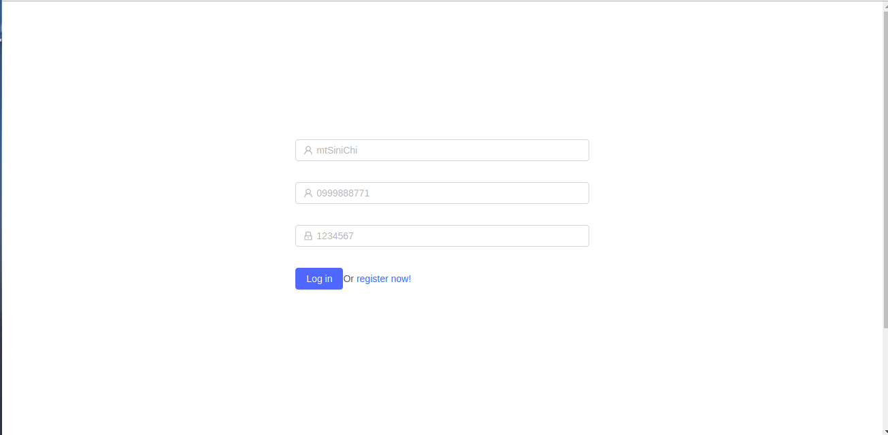
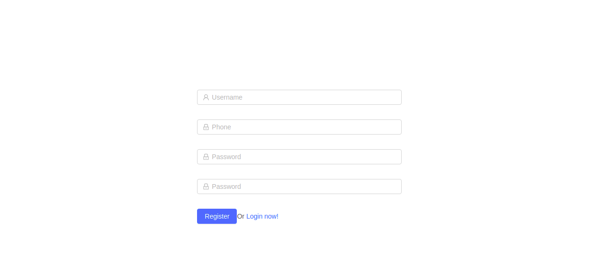
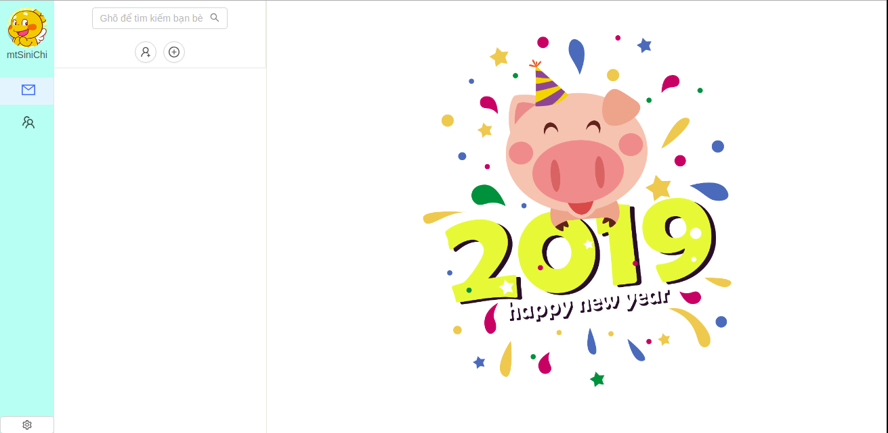

# Chat-app-reactjs-module6

Simple frontend Messenger/ Zalo chat application use ReactJS.

## GUI working on server

Chat app server Netty: https://github.com/mtsinichi/chat-app-netty

## Features

- Login/ logout
- Register
- Chat two people
- Chat group
- History chat
- Create conversations
- Show list of conversations
- Show message list of each conversation

## Techniques used

- [ReactJS](https://reactjs.org/): is a JavaScript library for building user interfaces. It is maintained by Facebook and a community of individual developers and companies. React can be used as a base in the development of single-page applications.
- [Redux - Thunk middleware](https://redux.js.org/): a predictable state container for JavaScript apps. Redux makes it easy to manage the state of your application.
- [Ant.design](https://ant.design/docs/react/introduce): following the Ant Design specification, we developed a React UI library *antd* that contains a set of high quality components and demos for building rich, interactive user interfaces.
- [Axios](https://github.com/axios/axios): Axios is a promise-based HTTP client that works both in the browser and in a node.js environment. It basically provides a single API for dealing with XMLHttpRequest s and node's http interface. Besides that, it wraps the requests using a polyfill for ES6 new's promise syntax.

## Installation

- GUI: Chat-app-reactjs-module6
    - Clone respository.
    - Use terminal and cd to the project folder.
    - Run `npm install` to install all node modules required.
    - Run `npm start` to start website in development environment.
    - Enjoy it.
- Server: Chat-app-netty
    - Clone respository. https://github.com/mtsinichi/chat-app-netty
    - Start main function: *WebSocketServer.main()*
    - Enjoy it.

## Screenshot

### Login

### Register

### Chat box

## Refer

This project was bootstrapped with [Create React App](https://github.com/facebook/create-react-app).
